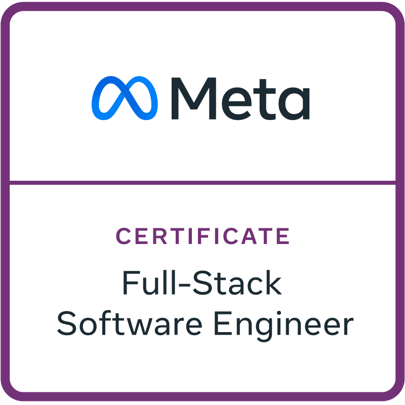
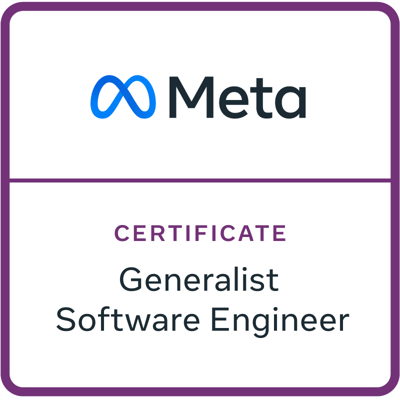
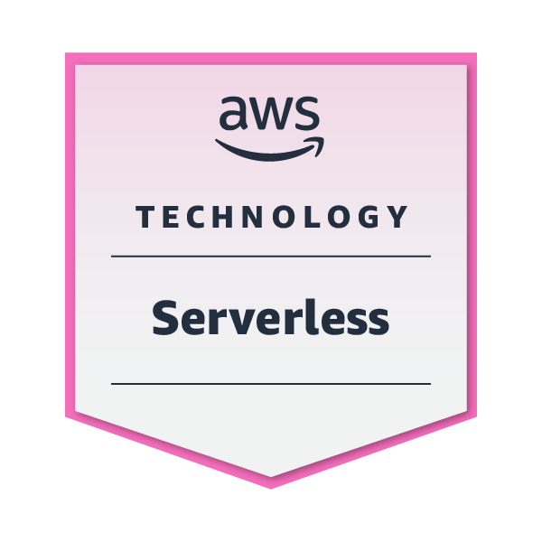
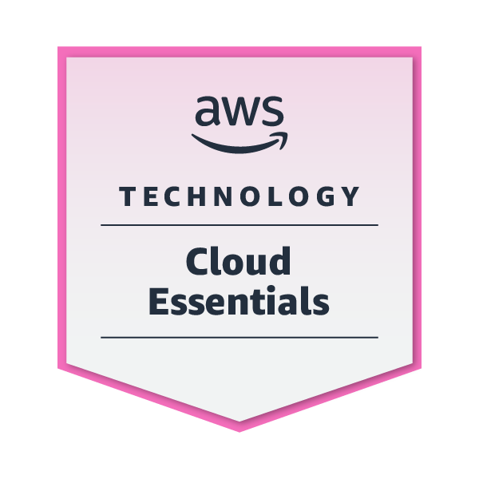
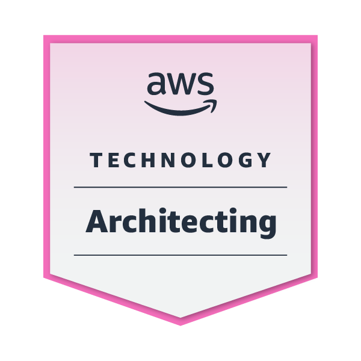
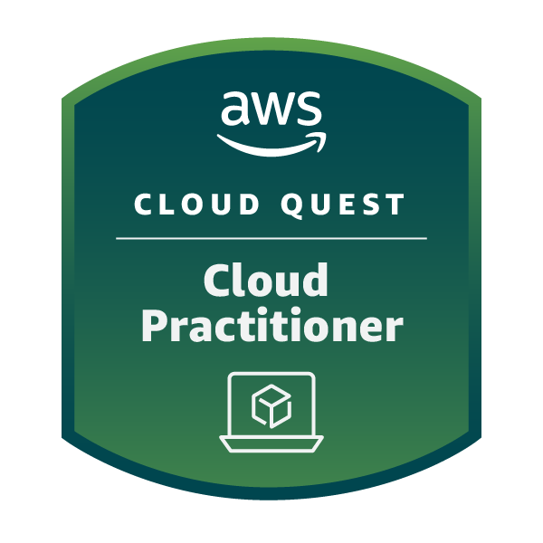

# Masei

Welcome to my GitHub profile! I'm marsei, a Senior Software Engineer with over 9 years of experience in Software, Web Backend development and architecture. I specialize in creating robust and scalable solutions using a wide array of technologies. My journey in tech has led me to work on innovative projects, contributing to both the development and architectural design of complex systems.

## Professional Scope & Responsibilities

I design and lead large-scale, real-time distributed systems powering millions of users.
I currently operate across multiple technical domains and seniority levels, based on the scope of responsibilities I regularly assume in production systems:

- **Developer 4 (Staff-level behaviors)** — system design, cross-service impact, long-term architecture
- **DevOps Engineer 3 (Senior)** — CI/CD, observability, deployment reliability, production incidents
- **Cloud Engineer 3 (Senior)** — AWS infrastructure, cost optimization, environment isolation
- **Cloud Architect 2 (Senior Cloud Architect)** — cloud architecture design, trade-offs, scalability & resilience
- **Tech Lead responsibilities** — technical direction, standards, unblocking teams

This reflects the level at which I contribute and am held accountable, rather than formal job titles.

### ⚡ Large-Scale Data & Real-Time Platforms

Architected pipelines handling massive continuous data streams 

Designed high-availability ETL, alerting, and notification ecosystems (batching, deduplication, latency optimization).

Lead modernization efforts toward event-driven, resilient, and horizontally scalable data services.

### 🌍 Geo-Spatial Search & Intelligence

Owner of high-performance geo-search and map computation architecture used across web & mobile.

Designed systems for geospatial clustering, ranking, and real-time map intelligence.

Lead initiatives improving accuracy, speed, and user experience across location-based features.

Built next-generation platforms leveraging OpenSearch, Redis, and geo-tile strategies for scalable map data.

Defined standards for efficient search caching, multi-layer map resolution, and intelligent marker generation.

### 🏗️ Backend, API, & Cloud Infrastructure Leadership

Architected public/private API ecosystems, enforcing strong SLAs, observability, and multi-region performance.

Designed secure cross-account AWS foundations using VPC networking, CloudFront, ALB/NLB, IAM, and S3-CDN pipelines.

Implemented SRE-grade reliability patterns (graceful degradation, circuit breakers, rate-limiting, auto-scaling).

### 🧩 System Design, Architecture Vision & Technical Leadership

Lead complex, multi-team initiatives bridging backend, mobile, web, DevOps, SRE, and product stakeholders.

Drive large technical spikes, RFCs, and redesigns for critical systems (NextGen map engines, caching strategy, markers, alerts).

Own documentation, specifications, architecture standards, and best practices.

Mentor engineers, elevate code quality culture, and guide architectural decision-making across teams.

### 🌫 Deep Domain Expertise

9+ years of leadership in the air quality, sensor data, environmental intelligence domain.

Deep understanding of sensor calibration, AQI computation, distributed ingestion, and high-volume environmental data workflows.

## 🚀 Languages, Technologies & Skills

### 💻 Programming Languages

  
  
  
  
  
  
  
  
  
  
  

### 🎨 Frontend Technologies

  
  
  
  

### 🗄️ Databases

  
  
  
  
  
  

### ☁️ Cloud Technologies

  
  
  

### 📊 Data Visualization & Analytics

  

## 🏅 Certifications & Badges

  
   
  
  
 
  
  
  
  
   
  
  
  
   
  

## 🚀 Skills

- **Programming Languages**: Proficient in NodeJS, GO, JavaScript, TypeScript, Python, C#, .NET, JAVA, JAVAEE, C, C++, and Ruby.
- **Cloud Technologies**: Extensive experience with Amazon AWS services (AWS ECS, EC2, Lambda, S3, openSearch, ELB), Google Firebase, and proficient in implementing cloud-native solutions.
- **Databases**: Skilled in PostgreSQL, MySQL, MS SQL Server, MongoDB, DynamoDB, and expertise in NoSQL databases.
- **DevOps & CI/CD**: Hands-on experience with Docker, CircleCi, Bitbucket Pipeline, and AWS DevOps tools.
- **Frontend Technologies**: Experience with React, Angular and building dynamic, user-centric web interfaces.
- **Others**: Proficient in data caching with ElastiCache Redis, Memcached, and content delivery using CloudFront.

## 💼 Professional Experience

- **Senior Software Developer (Since 2017) - Beijing, China**: Leading backend development, focusing on APIs, cloud architecture, and CI/CD processes. Key player in transitioning a monolithic system into a distributed architecture.
- **Software Developer (2016-2017) - Paris, France**: Developed modules in C#/.NET for the company software and created an internal project management application using Ruby on Rails.

- **Software Developer internships (2013-2015) - Paris, France**: Additional roles at Major companies and government entites that contributed to my foundation in software development.

## 🎓 Education

- **Master of Information Technologies** from EPITECH Paris,
- **Master of Software Engineering** from Beijing Jiaotong University

## 🌟 Achievements

- **Master degree Project**: A cross-platform mobile app and secure backend system facilitating healthcare document management.
- **Continuous Learning**: Regularly updating my skills through Udemy courses, focusing on AWS services and modern programming languages.

## 📫 Get in Touch

Feel free to reach out to me for collaborations, professional inquiries, or just a chat about technology.

---

Thanks for visiting my profile, and I look forward to connecting with you!

---

