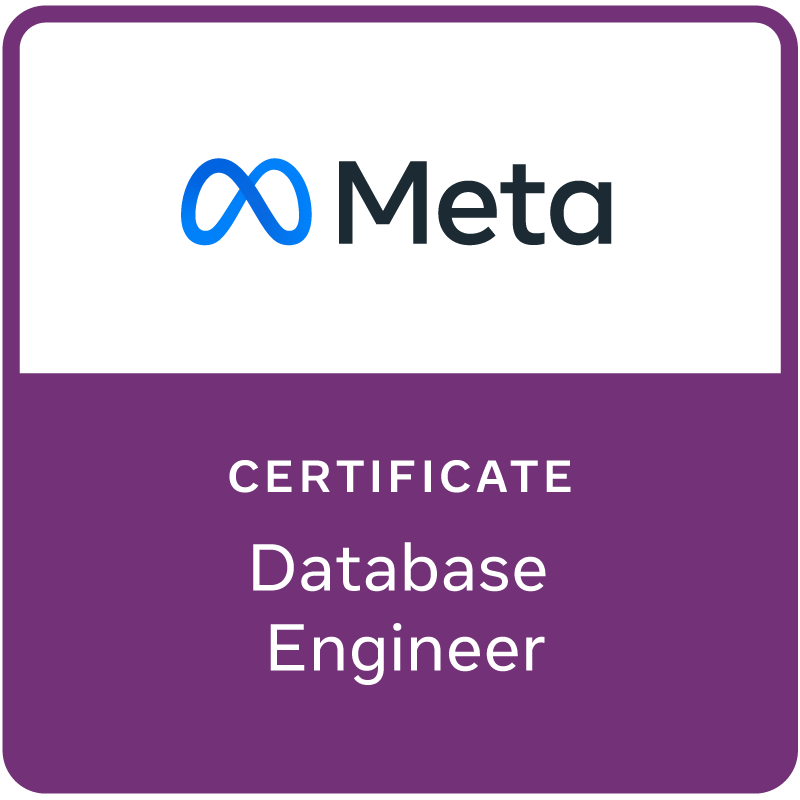

# Masei

Welcome to my GitHub profile! I'm marsei-l, a Senior Software Engineer with over 8 years of experience in backend development and architecture. I specialize in creating robust and scalable solutions using a wide array of technologies. My journey in tech has led me to work on innovative projects, contributing to both the development and architectural design of complex systems.

## 🚀 Skills

- **Programming Languages**: Proficient in NodeJS, GO, JavaScript, TypeScript, Python, C#, .NET, JAVA, JAVAEE, C, C++, and Ruby.
- **Cloud Technologies**: Extensive experience with Amazon AWS services (AWS ECS, EC2, Lambda, S3, openSearch, ELB), Google Firebase, and proficient in implementing cloud-native solutions.
- **Databases**: Skilled in PostgreSQL, MySQL, MS SQL Server, MongoDB, DynamoDB, and expertise in NoSQL databases.
- **DevOps & CI/CD**: Hands-on experience with Docker, CircleCi, Bitbucket Pipeline, and AWS DevOps tools.
- **Frontend Technologies**: Experience with React, Angular and building dynamic, user-centric web interfaces.
- **Others**: Proficient in data caching with ElastiCache Redis, Memcached, and content delivery using CloudFront.

## 💼 Professional Experience

- **Senior Software Developer (Since 2017) - Beijing, China**: Leading backend development, focusing on APIs, cloud architecture, and CI/CD processes. Key player in transitioning a monolithic system into a distributed architecture.
- **Software Developer (2016-2017) - Paris, France**: Developed modules in C#/.NET for the company software and created an internal project management application using Ruby on Rails.

- **Software Developer internships (2013-2015) - Paris, France**: Additional roles at Major companies and government entites that contributed to my foundation in software development.

## 🎓 Education

- **Master of Information Technologies** from EPITECH Paris,
- **Master of Software Engineering** from Beijing Jiaotong University

## 🏅 Certifications & Badges

  
  
  
  
  

## 🌟 Achievements

- **Master degree Project**: A cross-platform mobile app and secure backend system facilitating healthcare document management.
- **Continuous Learning**: Regularly updating my skills through Udemy courses, focusing on AWS services and modern programming languages.

## 📫 Get in Touch

Feel free to reach out to me for collaborations, professional inquiries, or just a chat about technology.

---

Thanks for visiting my profile, and I look forward to connecting with you!

---

